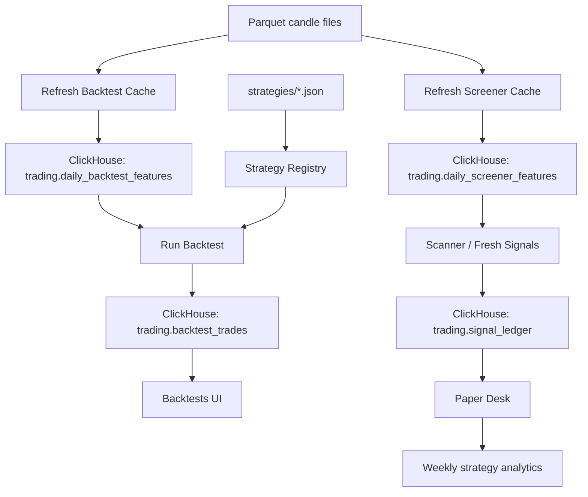

# Strategy Control And Fast Backtest Plan

Date: 2026-05-09

## User Goal

The user wants full control over the strategy lifecycle:

- import a new strategy without guessing the file format
- run a backtest from the UI
- avoid slow repeated parquet scans
- see which strategies are research-only, backtest-ready, fresh-signal-ready, and paper-trade-ready
- keep fresh signals unique so the same old names do not keep appearing every day

## Current System Flow



## What Changed

### Strategy Import

Added strategy registry endpoints:

- `GET /api/strategies`
- `POST /api/strategies/import`

The import endpoint validates JSON and writes to `strategies/<id>.json`.

Backtest-ready imported strategies can run when they use one of the supported templates:

- setup-family strategy with `entry.setup_family`, `entry.min_score`, TP, SL, hold sessions, and capital
- RSI10 pullback strategy with close above SMA200, RSI10 below 30, and RSI10 above 40 exit

Custom expressions still need a Rust/SQL rule mapping before they can run safely.

### Fast Backtest Cache

Added ClickHouse table:

```text
trading.daily_backtest_features
```

It stores daily rows with:

- OHLCV
- SMA20, SMA50, SMA200
- 20-day average volume
- 20-day high
- 52-week high/low
- RSI10
- breakout percent
- 52-week distance
- range position
- volume ratio
- setup booleans
- score

Added endpoint:

```text
POST /api/backtests/feature-cache/refresh
```

Backtest runs now read `trading.daily_backtest_features FINAL` instead of recalculating every rolling indicator from parquet on each request.

## UI Control Model

Backtests page controls:

- `Load Dashboard`: reads stored results only
- `Refresh Cache`: performs heavy parquet-to-ClickHouse feature refresh
- `Run Backtest`: runs strategy simulation from cached features
- `Load Registry`: shows strategy JSON files
- `Import JSON`: writes a new strategy JSON file

This gives the user control over expensive work.

## Strategy Promotion Levels

| Level | Meaning |
| --- | --- |
| Imported | JSON exists in `strategies/` |
| Backtest ready | Uses supported setup-family or RSI10 template |
| Research | Backtest can run, but not trusted yet |
| Fresh-signal ready | Scanner mapping exists and strategy is allowed in fresh-signal intake |
| Paper ready | Exit rule, TP, SL, max sessions, and ledger logic exist |
| Live ready | Needs broker execution controls and stronger validation |

## Why Backtest Was Slow

The old `/api/backtests/run` path scanned `file('parquets/candles_*.parquet', Parquet)` and recalculated daily candles, moving averages, highs/lows, RSI, and scores every time.

That is too slow for interactive strategy work.

The new path separates data prep from strategy testing:

1. Refresh cache when raw data changes.
2. Run many backtests against cached rows.

## Accuracy Audit

This is not yet a 100% portfolio-accurate live trading simulator.

What is now verified:

- Signals use features known at signal close.
- Entries happen on the next trading row's open.
- No latest-run trades had entry before signal-next-open.
- No latest-run trades had exit before entry.
- No latest-run trades had zero or negative entry/exit prices.
- RSI10 exits now respect earliest valid exit priority: stop, target, RSI40, then time.

Important remaining limitations:

- The runner is signal-level, not portfolio-level. It currently allows overlapping entries for the same `strategy_id + symbol` while a previous trade is still open.
- Daily OHLC cannot know intraday sequence. When stop and target happen on the same daily candle, the runner uses stop-first conservative handling.
- Fees, slippage, taxes, liquidity impact, order rejection, and partial fills are not included.
- The historical universe is the current enabled watchlist, so it can carry survivorship/watchlist-selection bias.
- Strategy variants can share the same underlying setup family, so total trades across all strategies are not independent portfolio trades.

The next accuracy upgrade should be a strict portfolio simulator:

1. One open position per symbol and strategy.
2. Max positions per day from strategy JSON.
3. Total capital cap.
4. Fees and slippage.
5. Optional no-overlap mode beside current signal-level mode.

## Remaining Work

- Add a background job runner so long cache refreshes do not hold one HTTP request open.
- Add a richer JSON expression compiler for custom rules.
- Add per-strategy run controls: selected strategy, date range, capital, max positions.
- Add cache freshness badge beside every backtest run.
- Add promotion button after enough Paper Desk forward-test evidence is collected.
