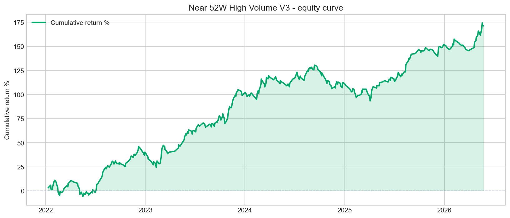
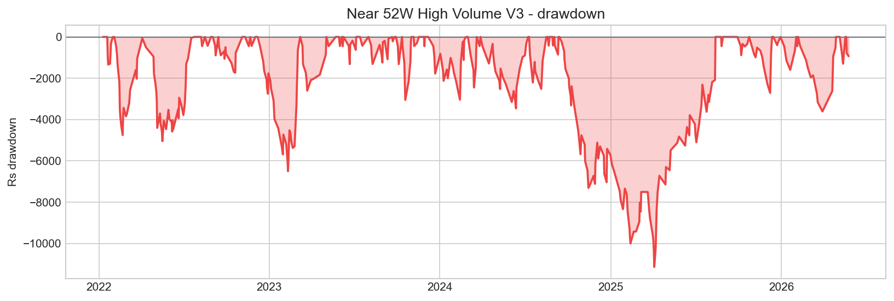
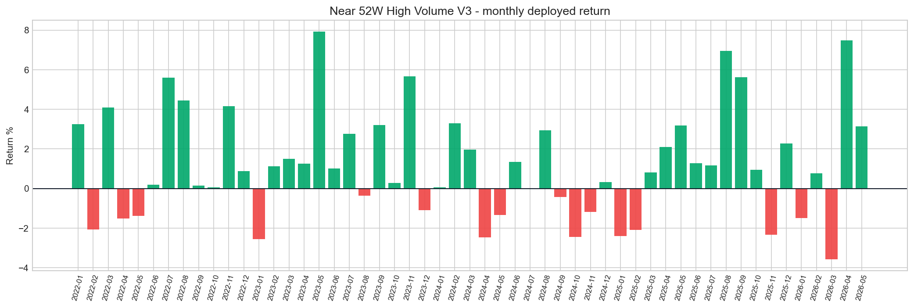
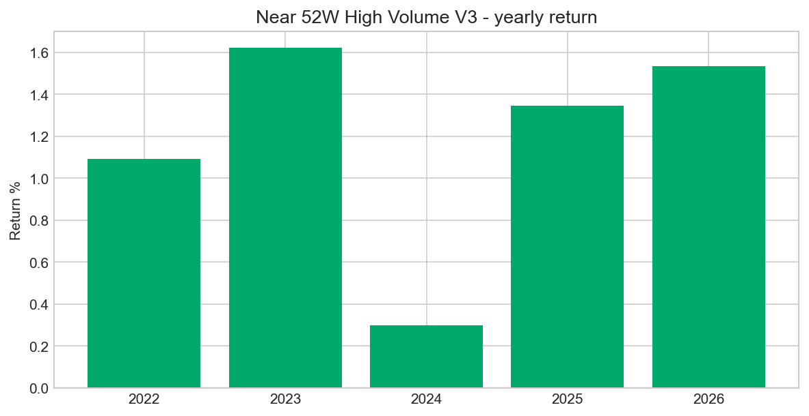
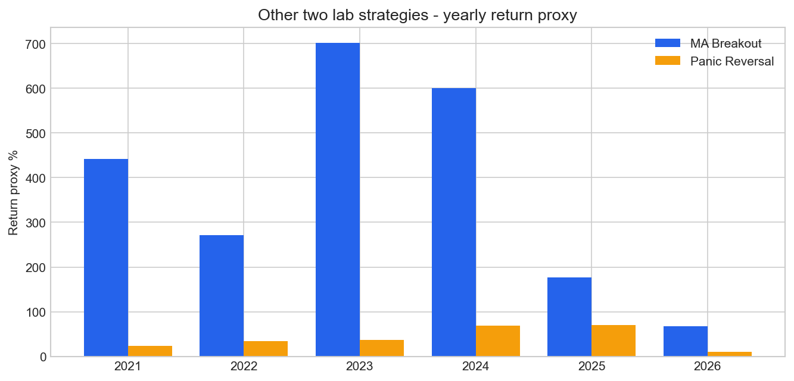
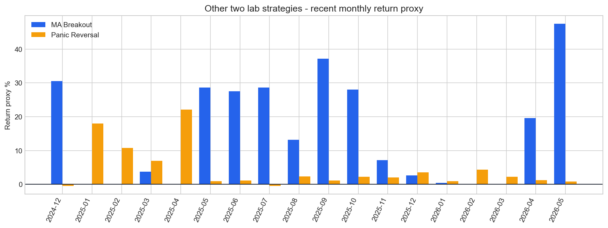

# Strategy Research Snapshot - 2026-05-30

Scope: current UI-selected strategy `Near 52W High Volume V3`, plus the two Python lab strategies we were testing: `MA Breakout` and `Panic Reversal`.

## Current strategy: Near 52W High Volume V3

| Metric | Value |
| --- | --- |
| Total trades | 497 |
| Total P&L | Rs 51,371.10 |
| Return over time | +171.24% |
| Win rate | 43.06% |
| Profit factor | 1.44 |
| Expectancy / avg trade | +1.06% |
| Max drawdown | Rs -11,137.85 |
| Positive days | 46.67% |
| Profitable months | 36/53 (67.9%) |
| Positive years | 5/5 |
| Best month | Nov 2023 Rs 6,682.81 / +5.66% |
| Worst month | Feb 2022 Rs -3,369.17 / -2.07% |

### Yearly detail

| Year | Trades | Win | P&L | Return |
| --- | --- | --- | --- | --- |
| 2022 | 115 | 44.35% | Rs 12,051.66 | +1.09% |
| 2023 | 112 | 48.21% | Rs 17,663.42 | +1.62% |
| 2024 | 133 | 34.59% | Rs 3,728.26 | +0.30% |
| 2025 | 97 | 46.39% | Rs 12,147.01 | +1.34% |
| 2026 | 40 | 45.00% | Rs 5,780.75 | +1.53% |

### Best stock matches

| Symbol | Trades | Win | P&L | Avg return |
| --- | --- | --- | --- | --- |
| TRITURBINE | 5 | 80.00% | Rs 3,461.28 | +7.10% |
| SUNPHARMA | 6 | 66.67% | Rs 1,723.35 | +3.06% |
| BLUESTARCO | 6 | 66.67% | Rs 1,527.67 | +2.71% |
| WELSPUNLIV | 5 | 60.00% | Rs 2,092.20 | +4.20% |
| BEL | 5 | 60.00% | Rs 2,088.87 | +4.20% |
| CARTRADE | 5 | 60.00% | Rs 1,827.84 | +4.20% |
| ACUTAAS | 5 | 60.00% | Rs 1,815.22 | +4.20% |
| CHOLAFIN | 5 | 60.00% | Rs 420.40 | +0.84% |
| NH | 12 | 58.33% | Rs 3,917.22 | +3.50% |
| GVT&D | 7 | 57.14% | Rs 2,447.34 | +3.79% |

### Weak stock matches

| Symbol | Trades | Win | P&L | Avg return |
| --- | --- | --- | --- | --- |
| MAXHEALTH | 6 | 0.00% | Rs -2,646.98 | -4.50% |
| ZENSARTECH | 5 | 0.00% | Rs -2,192.82 | -4.50% |
| TORNTPOWER | 5 | 20.00% | Rs -1,672.36 | -3.46% |
| CHENNPETRO | 5 | 20.00% | Rs -717.89 | -1.60% |
| COROMANDEL | 6 | 33.33% | Rs -165.79 | -0.16% |
| WELCORP | 6 | 33.33% | Rs 277.10 | +0.33% |
| AMBER | 5 | 40.00% | Rs 317.21 | +1.30% |
| CHOLAFIN | 5 | 60.00% | Rs 420.40 | +0.84% |
| VBL | 6 | 50.00% | Rs 456.81 | +0.76% |
| GPIL | 5 | 40.00% | Rs 633.42 | +1.30% |

## Other two strategies from the lab

| Strategy | Trades | Return / expectancy | Win | Profit factor | Max DD | Evidence |
| --- | --- | --- | --- | --- | --- | --- |
| Near 52W High Volume V3 | 497 | +171.24% | 43.06% | 1.44 | Rs -11,137.85 | 36/53 |
| MA Breakout lab | 4,991 | +4.53% expectancy | 73.81% | 5.78 | -12.17% | OOS 895 trades |
| Panic Reversal lab | 309 | +7.89% expectancy | 74.11% | 12.88 | -1.87% | OOS 47 trades |

### MA Breakout tuned model

| Field | Value |
| --- | --- |
| Model | ma_l20_t10_rs0.58_rv1.3_b0.38_cl0.58_h75_p3 |
| Setup | 20D breakout, 10D trail, RS >= 0.58, relvol >= 1.3 |
| Full sample | 4,991 trades, 73.81% win, PF 5.78, expectancy +4.53% |
| Validation | 1,034 trades, expectancy +4.51%, PF 5.23 |
| OOS | 895 trades, expectancy +2.69%, PF 3.94, DD -3.15% |

### Panic Reversal tuned model

| Field | Value |
| --- | --- |
| Model | panic_r0.08_ra1.35_cl0.64_rec0.012_sym_reclaim25_pre3_h12 |
| Setup | 3D panic <= -0.08, ATR range >= 1.35, close location >= 0.64, entry reclaim25 |
| Full sample | 309 trades, 74.11% win, PF 12.88, expectancy +7.89% |
| Validation | 101 trades, expectancy +10.24%, PF 14.61 |
| OOS | 47 trades, expectancy +4.86%, PF 8.25, DD -0.53% |

## Read before live

- Near 52W High Volume V3 has strong total return, but only 43.06% win rate and 46.67% positive days. It can work, but drawdown and stop clusters matter.
- MA Breakout is the strongest broad sample from the lab: 4,991 full trades and 895 OOS trades with positive OOS expectancy.
- Panic Reversal is very clean on quality metrics, but sample size is much smaller: 309 full trades and 47 OOS trades. Treat it as a specialist setup, not a daily engine.
- Before live: paper trade the exact trigger rules and compare forward slippage/fees against these curves.